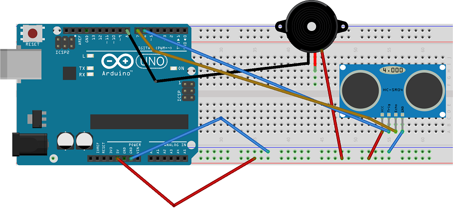

# Sistema anti-intrusos con Arduino

## Descripcion:
Sistema basico de alarma con Arduino. El sistema configura un rango de deteccion (de 0 a 79 cm por defecto, configurable hasta 400cm) y hace sonar un buzzer en caso que detecte un obstaculo.

## Componentes necesarios:

 * Arduino UNO
 * HC - SR04
 * KY-012
 * Protoboard

## Diagrama

Nota: la polaridad del buzzer esta invertida a proposito para compensar un fallo de fabrica de los KY-012, en caso de tener un modelo distinto de buzzer respetar la polaridad que viene en el datasheet.

## Vista previa

